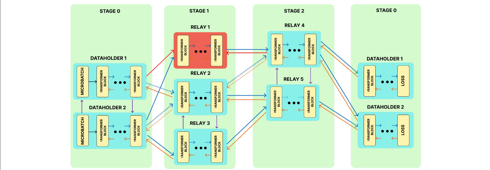

---

##### Links:

- [Publication](https://doi.org/10.48550/arXiv.2509.21221)
- [Paper](https://arxiv.org/pdf/2509.21221)
- [Code](https://github.com/paper_repo)

---

##### Abstract:

Motivated by the emergence of large language models (LLMs) and the importance of democratizing their training, we propose GWTF, the first crash tolerant practical decentralized training framework for LLMs. Differently from existing distributed and federated training frameworks, GWTF enables the efficient collaborative training of a LLM on heterogeneous clients that volunteer their resources. In addition, GWTF addresses node churn, i.e., clients joining or leaving the system at any time, and network instabilities, i.e., network links becoming unstable or unreliable. The core of GWTF is a novel decentralized flow algorithm that finds the most effective routing that maximizes the number of microbatches trained with the lowest possible delay. We extensively evaluate GWTF on GPT-like and LLaMa-like models and compare it against the prior art. Our results indicate that GWTF reduces the training time by up to 45% in realistic and challenging scenarios that involve heterogeneous client nodes distributed over 10 different geographic locations with a high node churn rate. 

---

##### Figure 1:  Crash-recovery during decentralized training of an LLM



---

##### Citation

Blagoev, N., Cox, B., Decouchant, J., & Chen, L. Y. (2025). Go With The Flow: Churn-Tolerant Decentralized Training of Large Language Models. arXiv preprint arXiv:2509.21221. https://doi.org/10.48550/arXiv.2509.21221.

```BibTeX
@misc{blagoev2025flowchurntolerantdecentralizedtraining,
      title={Go With The Flow: Churn-Tolerant Decentralized Training of Large Language Models}, 
      author={Nikolay Blagoev and Bart Cox and Jérémie Decouchant and Lydia Y. Chen},
      year={2025},
      eprint={2509.21221},
      archivePrefix={arXiv},
      primaryClass={cs.LG},
      url={https://arxiv.org/abs/2509.21221}, 
}
```

---