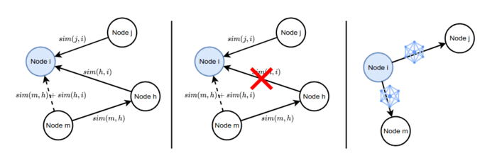

---

##### Links:

<!-- - [Publication](paper.pdf)
- [Paper](appendix.pdf) -->
- [Code](https://github.com/bacox/morph)

---

##### Abstract:

Decentralized learning (DL) enables a set of nodes to train a model collaboratively without central coordination, offering benefits for privacy and scalability. However, DL struggles to train a high accuracy model when the data distribution is non-independent and identically distributed (non-IID) and when the communication topology is static. To address these issues, we propose Morph, a topology optimization algorithm for DL. In Morph, nodes adaptively choose peers for model exchange based on maximum model dissimilarity. Morph maintains a fixed in-degree while dynamically reshaping the communication graph through gossip-based peer discovery and diversity-driven neighbor selection, thereby improving robustness to data heterogeneity. Experiments on CIFAR-10 and FEMNIST with up to 100 nodes show that Morph consistently outperforms static and epidemic baselines, while closely tracking the fully connected upper bound. On CIFAR-10, Morph achieves a relative improvement of 1.12× in test accuracy compared to the state-of-the-art baselines. On FEMNIST, Morph achieves an accuracy that is 1.08× higher than Epidemic Learning. Similar trends hold for 50-node deployments, where Morph narrows the gap to the fully connected upper bound within 0.5 percentage points on CIFAR-10. These results demonstrate that Morph achieves higher final accuracy, faster convergence, and more stable learning as quantified by lower inter-node variance, while requiring fewer communication rounds than baseline.

---

##### Figure 1: Topology Upodate



---

<!-- ##### Citation

Author 1, Author 2. Year. "Title." *Journal* Volume (Issue): First page–Last page. https://doi.org/paper_doi.

```BibTeX
@article{AAYY,
author = {Author 1 and Author 2},
doi = {paper_doi},
journal = {Journal},
number = {Issue},
pages = {XXX--YYY},
title = {Title},
volume = {Volume},
year = {Year}}
``` -->

---