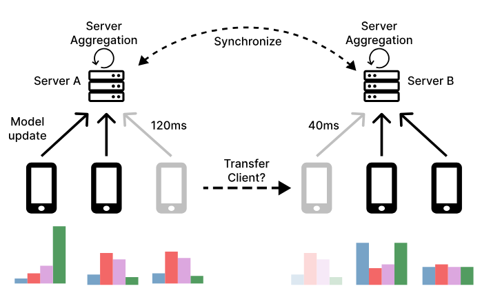

---

##### Links:

<!-- - [Publication](paper.pdf)
- [Paper](appendix.pdf) -->
- [Code](https://github.com/bacox/Nomad)

---

##### Abstract:

In geo-distributed Federated Learning (FL), deploying multiple servers near clients reduces latency and speeds up training. However, current approaches often underperform because they rely on static client-to-server assignments, which overlook dynamic network conditions and heterogeneous client data distributions. We present Nomad, the first dynamic client transfer framework for multi-server FL that adaptively reallocates clients to minimize latency and align client data distributions with those of their servers. Unlike prior methods, Nomad supports flexible client migration during training, driven by both network and data metrics. Through extensive experiments, we demonstrate that Nomad improves test accuracy by up to 31.8 percentage points under join-only scenarios and up to 18.8 percentage points under leave & join (churn) scenarios, outperforms strong baselines by 1-3 percentage points across conditions, and scales effectively under geographic constraints.

---

##### Figure 2:  Client transfers between servers



---

<!-- ##### Citation

Author 1, Author 2. Year. "Title." *Journal* Volume (Issue): First page–Last page. https://doi.org/paper_doi.

```BibTeX
@article{AAYY,
author = {Author 1 and Author 2},
doi = {paper_doi},
journal = {Journal},
number = {Issue},
pages = {XXX--YYY},
title = {Title},
volume = {Volume},
year = {Year}}
```

--- -->