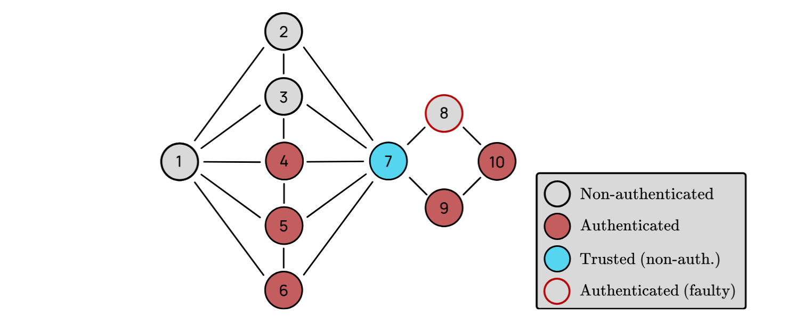

---

##### Links:

- [Publication](https://doi.org/10.4230/LIPIcs.OPODIS.2024.25)
- [Paper](https://drops.dagstuhl.de/storage/00lipics/lipics-vol324-opodis2024/LIPIcs.OPODIS.2024.25/LIPIcs.OPODIS.2024.25.pdf)

---

##### Abstract:

Reliable communication is a fundamental distributed communication abstraction that allows any two nodes within a network to communicate with each other. It is necessary for more powerful communication primitives, such as broadcast and consensus. Using different authentication models, two classical protocols implement reliable communication in unknown and sufficiently connected networks. In the former, network links are authenticated, and processes rely on dissemination paths to authenticate messages. In the latter, processes generate digital signatures that are flooded throughout the network. This work considers the hybrid system model that combines authenticated links and authenticated processes. Additionally, we aim to leverage the possible presence of trusted nodes (e.g., network gateways) and trusted components (e.g., Intel SGX enclaves). We first extend the two classical reliable communication protocols to leverage trusted nodes. Then we propose DualRC, our most generic algorithm that considers the hybrid authentication model by manipulating dissemination paths and digital signatures, and leverages the possible presence of trusted nodes and trusted components. We describe and prove methods that establish whether our algorithms implement reliable communication on a given network.

---

##### Figure 4:  Example of a network where not forwarding signatures after delivering a message based on dissemination paths would prevent some nodes from authenticating it.



---

##### Citation

Chotkan, R., Cox, B., Rahli, V., & Decouchant, J. (2025). Reliable Communication in Hybrid Authentication and Trust Models. In 28th International Conference on Principles of Distributed Systems (OPODIS 2024) (pp. 25-1). Schloss Dagstuhl–Leibniz-Zentrum für Informatik. https://doi.org/10.4230/LIPIcs.OPODIS.2024.25.

```BibTeX
@InProceedings{chotkan_et_al:LIPIcs.OPODIS.2024.25,
  author =	{Chotkan, Rowdy and Cox, Bart and Rahli, Vincent and Decouchant, J\'{e}r\'{e}mie},
  title =	{{Reliable Communication in Hybrid Authentication and Trust Models}},
  booktitle =	{28th International Conference on Principles of Distributed Systems (OPODIS 2024)},
  year =	{2025},
  volume =	{324},
  URL =		{https://drops.dagstuhl.de/entities/document/10.4230/LIPIcs.OPODIS.2024.25},
  URN =		{urn:nbn:de:0030-drops-225611},
  doi =		{10.4230/LIPIcs.OPODIS.2024.25},
  annote =	{Keywords: Reliable communication, Byzantine, Authentication models, Trust}
}
```

---