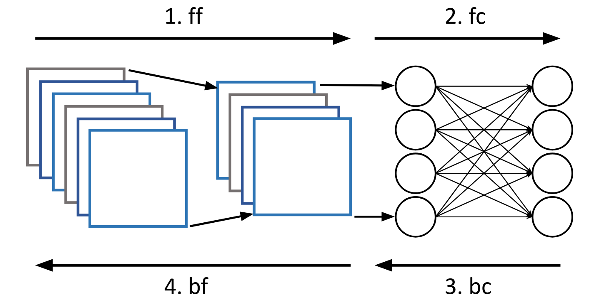

---

##### Links:

- [Code](https://github.com/bacox/fltk)

---

##### Abstract:


Federated Learning (FL) is a popular deep learning approach that prevents centralizing large amounts of data, and instead relies on clients that update a global model using their local datasets. Classical FL algorithms use a central federator that, for each training round, waits for all clients to send their model updates before aggregating them. In practical deployments, clients might have different computing powers and network capabilities, which might lead slow clients to become performance bottlenecks. Previous works have suggested to use a deadline for each learning round so that the federator ignores the late updates of slow clients, or so that clients send partially trained models before the deadline. To speed up the training process, we instead propose Aergia, a novel approach where slow clients (i) freeze the part of their model that is the most computationally intensive to train; (ii) train the unfrozen part of their model; and (iii) offload the training of the frozen part of their model to a faster client that trains it using its own dataset. The offloading decisions are orchestrated by the federator based on the training speed that clients report and on the similarities between their datasets, which are privately evaluated thanks to a trusted execution environment. We show through extensive experiments that Aergia maintains high accuracy and significantly reduces the training time under heterogeneous settings by up to 27% and 53% compared to FedAvg and TiFL, respectively.


##### Figure 3:  Model training phases during a local training



---

##### Citation

Cox, B., Chen, L. Y., & Decouchant, J. (2022, November). Aergia: leveraging heterogeneity in federated learning systems. In Proceedings of the 23rd ACM/IFIP International Middleware Conference (pp. 107-120). https://doi.org/10.1145/3528535.3565238.

```BibTeX
@inproceedings{cox2022aergia,
  title={Aergia: leveraging heterogeneity in federated learning systems},
  author={Cox, Bart and Chen, Lydia Y and Decouchant, J{\'e}r{\'e}mie},
  booktitle={Proceedings of the 23rd ACM/IFIP International Middleware Conference},
  url = {https://doi.org/10.1145/3528535.3565238},
  doi = {10.1145/3528535.3565238},
  pages={107--120},
  year={2022}
}
```

---