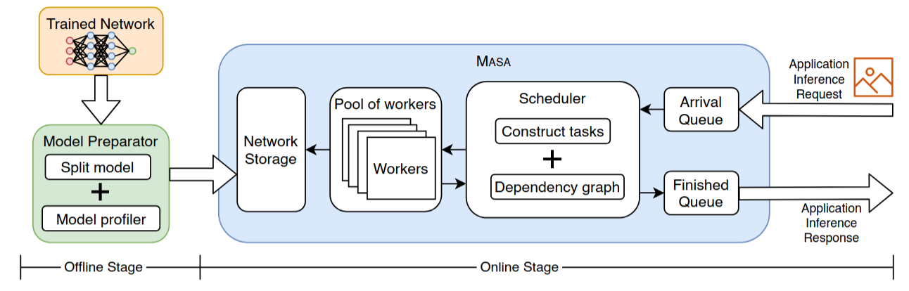

---

##### Links

+ [Publication](https://ieeexplore.ieee.org/abstract/document/9439111)
+ [Code](https://github.com/bacox/edgecaffe)

---

##### Abstract

Deep neural networks (DNNs) are becoming the core components of many applications running on edge devices, especially for real time image-based analysis. Increasingly, multi-faced knowledge is extracted via executing multiple DNNs inference models, e.g., identifying objects, faces, and genders from images. The response times of multi-DNN highly affect users’ quality of experience and safety as well. Different DNNs exhibit diversified resource requirements and execution patterns across layers and networks, which may easily exceed the available device memory and riskily degrade the responsiveness. In this paper, we design and implement Masa, a responsive memory-aware multi-DNN execution framework, an on-device middleware featuring on modeling inter- and intra-network dependency and leveraging complimentary memory usage of each layer. Masa can consistently ensure the average response time when deterministically and stochastically executing multiple DNN-based image analyses. We extensively evaluate Masa on three configurations of Raspberry Pi and a large set of popular DNN models triggered by different generation patterns of images. Our evaluation results show that Masa can achieve lower average response times by up to 90% on devices with small memory, i.e., 512 MB to 1 GB, compared to the state of the art multi-DNN scheduling solutions.

---

##### Figure 3: Architecture of M ASA



---

##### Citation

B. Cox, J. Galjaard, A. Ghiassi, R. Birke and L. Y. Chen, "Masa: Responsive Multi-DNN Inference on the Edge," 2021 IEEE International Conference on Pervasive Computing and Communications (PerCom), 2021, pp. 1-10, doi: 10.1109/PERCOM50583.2021.9439111..

```latex
@INPROCEEDINGS{9439111,
  author={Cox, Bart and Galjaard, Jeroen and Ghiassi, Amirmasoud and Birke, Robert and Chen, Lydia Y.},
  booktitle={2021 IEEE International Conference on Pervasive Computing and Communications (PerCom)}, 
  title={Masa: Responsive Multi-DNN Inference on the Edge}, 
  year={2021},
  volume={},
  number={},
  pages={1-10},
  doi={10.1109/PERCOM50583.2021.9439111}
}
```

---