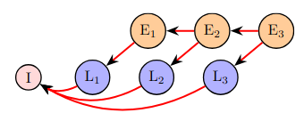

---

##### Links:

- [Publication](https://ieeexplore.ieee.org/abstract/document/9430952/)
- [Code](https://github.com/bacox/edgecaffe)

---

##### Abstract:

The execution of deep neural network (DNN) inference jobs on edge devices has become increasingly popular. Multiple of such inference models can concurrently analyse the on-device data, e.g. images, to extract valuable insights. Prior art focuses on low-power accelerators, compressed neural network architectures, and specialized frameworks to reduce execution time of single inference jobs on edge devices which are resource constrained. However, it is little known how different scheduling policies can further improve the runtime performance of multi-inference jobs without additional edge resources. To enable the exploration of scheduling policies, we first develop an execution framework, EdgeCaffe, which splits the DNN inference jobs by loading and execution of each network layer. We empirically characterize the impact of loading and scheduling policies on the execution time of multi-inference jobs and point out their dependency on the available memory space. We propose a novel memory-aware scheduling policy, MemA, which opportunistically interleaves the executions of different types of DNN layers based on their estimated run-time memory demands. Our evaluation on exhaustive combinations of five networks, data inputs, and memory configurations show that MemA can alleviate the degradation of execution times of multi-inference (up to 5×) under severely constrained memory compared to standard scheduling policies without affecting accuracy.

---

##### Figure 2:  Relaxed loading policy ordering



---

##### Citation

J. Galjaard, B. Cox, A. Ghiassi, L. Y. Chen and R. Birke, "MemA: Fast Inference of Multiple Deep Models," 2021 IEEE International Conference on Pervasive Computing and Communications Workshops and other Affiliated Events (PerCom Workshops), 2021, pp. 281-286, doi: 10.1109/PerComWorkshops51409.2021.9430952.

```BibTeX
@INPROCEEDINGS{9430952,
  author={Galjaard, Jeroen and Cox, Bart and Ghiassi, Amirmasoud and Chen, Lydia Y. and Birke, Robert},
  booktitle={2021 IEEE International Conference on Pervasive Computing and Communications Workshops and other Affiliated Events (PerCom Workshops)}, 
  title={MemA: Fast Inference of Multiple Deep Models}, 
  year={2021},
  volume={},
  number={},
  pages={281-286},
  doi={10.1109/PerComWorkshops51409.2021.9430952}
}
```

---