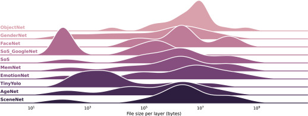

---

##### Links:

- [Publication](https://www.sciencedirect.com/science/article/pii/S1574119222000372)
- [Code](https://github.com/bacox/edgecaffe)

---

##### Abstract:

Deep neural networks (DNNs) are becoming the core components of many applications running on edge devices, especially for real time image-based analysis. Increasingly, multi-faced knowledge is extracted by executing multiple DNNs inference models, e.g., identifying objects, faces, and genders from images. It is of paramount importance to guarantee low response times of such multi-DNN executions as it affects not only users quality of experience but also safety. The challenge, largely unaddressed by the state of the art, is how to overcome the memory limitation of edge devices without altering the DNN models. In this paper, we design and implement Masa, a responsive memory-aware multi-DNN execution and scheduling framework, which requires no modification of DNN models. The aim of Masa is to consistently ensure the average response time when deterministically and stochastically executing multiple DNN-based image analyses. The enabling features of Masa are (i) modeling inter- and intra-network dependency, (ii) leveraging complimentary memory usage of each layer, and (iii) exploring the context dependency of DNNs. We verify the correctness and scheduling optimality via mixed integer programming. We extensively evaluate two versions of Masa, context-oblivious and context-aware, on three configurations of Raspberry Pi and a large set of popular DNN models triggered by different generation patterns of images. Our evaluation results show that Masa can achieve lower average response times by up to 90% on devices with small memory, i.e., 512 MB to 1 GB, compared to the state of the art multi-DNN scheduling solutions.

---

##### Figure 2: Layer size distribution



---

##### Citation

Cox, Bart, Robert Birke, and Lydia Y. Chen. "Memory-aware and context-aware multi-DNN inference on the edge." Pervasive and Mobile Computing 83 (2022): 101594. ISSN 1574-1192, doi: https://doi.org/10.1016/j.pmcj.2022.101594.

```BibTeX
@article{cox2022memory,
  author={Cox, Bart and Birke, Robert and Chen, Lydia Y},
title = {Memory-aware and context-aware multi-DNN inference on the edge},
journal = {Pervasive and Mobile Computing},
volume = {83},
pages = {101594},
year = {2022},
issn = {1574-1192},
doi = {https://doi.org/10.1016/j.pmcj.2022.101594},
url = {https://www.sciencedirect.com/science/article/pii/S1574119222000372}
}
```

---

##### Related material

+ [Presentation slides](presentation.pdf)