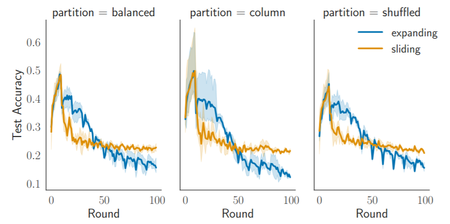

---

##### Links:

- [Publication](https://link.springer.com/chapter/10.1007/978-3-031-74643-7_35)
- [Paper](https://arxiv.org/pdf/2406.02015)
- [Code](https://gitlab.ewi.tudelft.nl/dmls/publications/freddie)

---

##### Abstract:

Federated Learning (FL) systems evolve in heterogeneous and ever-evolving environments that challenge their performance. Under real deployments, the learning tasks of clients can also evolve with time, which calls for the integration of methodologies such as Continual Learning. To enable research reproducibility, we propose a set of experimental best practices that precisely capture and emulate complex learning scenarios. Our framework, Freddie, is the first entirely configurable framework for Federated Continual Learning (FCL), and it can be seamlessly deployed on a large number of machines thanks to the use of Kubernetes and containerization. We demonstrate the effectiveness of Freddie on two use cases, (i) large-scale FL on CIFAR100 and (ii) heterogeneous task sequence on FCL, which highlight unaddressed performance challenges in FCL scenarios.

---

##### Figure 4:  Reduced catastrophic forgetting effect



---

##### Citation

Cox, B., Galjaard, J., Shankar, A., Decouchant, J., Chen, L.Y. (2025). Parameterizing Federated Continual Learning for Reproducible Research. In: Meo, R., Silvestri, F. (eds) Machine Learning and Principles and Practice of Knowledge Discovery in Databases. ECML PKDD 2023. Communications in Computer and Information Science, vol 2137. Springer, Cham. https://doi.org/10.1007/978-3-031-74643-7_35
```BibTeX
@InProceedings{10.1007/978-3-031-74643-7_35,
author="Cox, Bart
and Galjaard, Jeroen
and Shankar, Aditya
and Decouchant, J{\'e}r{\'e}mie
and Chen, Lydia Y.",
title="Parameterizing Federated Continual Learning for Reproducible Research",
booktitle="Machine Learning and Principles and Practice of Knowledge Discovery in Databases",
year="2025",
publisher="Springer Nature Switzerland",
address="Cham",
pages="478--486",
isbn="978-3-031-74643-7"
}
```

---