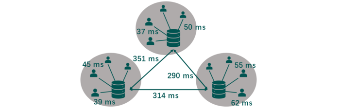

---

##### Links:

- [Publication](https://doi.org/10.1145/3652892.3700778)
- [Paper](https://dl.acm.org/doi/pdf/10.1145/3652892.3700778)
- [Code](https://github.com/bacox/Morph)

---

##### Abstract:

Federated learning (FL) systems enable multiple clients to train a machine learning model iteratively through synchronously exchanging the intermediate model weights with a single server. The scalability of such FL systems can be limited by two factors: server idle time due to synchronous communication and the risk of a single server becoming the bottleneck. In this paper, we propose a new FL architecture, Spyker, the first multi-server FL system that is entirely asynchronous, and therefore addresses these two limitations simultaneously. Spyker keeps both servers and clients continuously active. As in previous multi-server methods, clients interact solely with their nearest server, ensuring efficient update integration into the model. Differently, however, servers also periodically update each other asynchronously, and never postpone interactions with clients. We compare Spyker to three representative baselines – FedAvg, FedAsync and HierFAVG – on the MNIST and CIFAR-10 image classification datasets and on the WikiText-2 language modeling dataset.

---

##### Figure 2:  Flat Multi-Server



---

##### Citation

Zuo, Y., Cox, B., Chen, L. Y., & Decouchant, J. (2024, December). Spyker: Asynchronous multi-server federated learning for geo-distributed clients. In Proceedings of the 25th International Middleware Conference (pp. 367-378). https://doi.org/10.1145/3652892.3700778.

```BibTeX
@inproceedings{10.1145/3652892.3700778,
author = {Zuo, Yuncong and Cox, Bart and Chen, Lydia Y. and Decouchant, J\'{e}r\'{e}mie},
title = {Spyker: Asynchronous Multi-Server Federated Learning for Geo-Distributed Clients},
year = {2024},
isbn = {9798400706233},
publisher = {Association for Computing Machinery},
address = {New York, NY, USA},
url = {https://doi.org/10.1145/3652892.3700778},
doi = {10.1145/3652892.3700778},
booktitle = {Proceedings of the 25th International Middleware Conference},
pages = {367–378},
numpages = {12},
keywords = {byzantine learning, asynchronous learning, resource heterogeneity},
location = {Hong Kong, Hong Kong},
series = {Middleware '24}
}
```

---