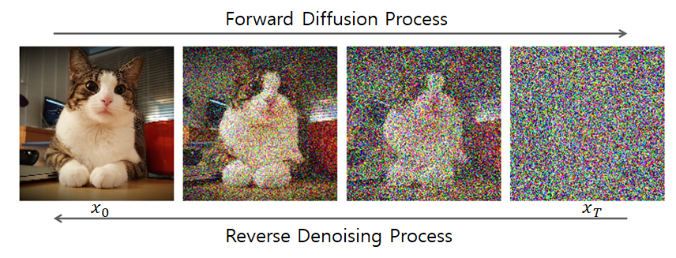

---

##### Links:

- [Publication](https://doi.org/10.48550/arXiv.2406.12575)
- [Paper](https://arxiv.org/pdf/2406.12575)
- [Code](https://gitlab.ewi.tudelft.nl/dmls/publications/FedDiffuse)

---

##### Abstract:

The training of diffusion-based models for image generation is predominantly controlled by a select few Big Tech companies, raising concerns about privacy, copyright, and data authority due to their lack of transparency regarding training data. To ad-dress this issue, we propose a federated diffusion model scheme that enables the independent and collaborative training of diffusion models without exposing local data. Our approach adapts the Federated Averaging (FedAvg) algorithm to train a Denoising Diffusion Model (DDPM). Through a novel utilization of the underlying UNet backbone, we achieve a significant reduction of up to 74% in the number of parameters exchanged during training,compared to the naive FedAvg approach, whilst simultaneously maintaining image quality comparable to the centralized setting, as evaluated by the FID score. 

---

##### Figure:  Diffusion Process



---

##### Citation

de Goede, M., Cox, B., & Decouchant, J. (2024). Training diffusion models with federated learning. arXiv preprint arXiv:2406.12575. https://doi.org/10.48550/arXiv.2406.12575.

```BibTeX
@misc{degoede2024trainingdiffusionmodelsfederated,
      title={Training Diffusion Models with Federated Learning}, 
      author={Matthijs de Goede and Bart Cox and Jérémie Decouchant},
      year={2024},
      eprint={2406.12575},
      archivePrefix={arXiv},
      primaryClass={cs.LG},
      url={https://arxiv.org/abs/2406.12575}, 
}
```

---